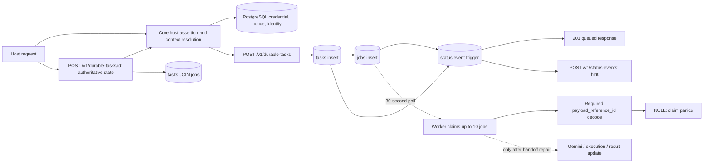

# Vox Core durable-task performance investigation

Date: 2026-09-25. Code revision: `a4129c128a03b772f6bcfc339ad11ae60d41dd78`.

## Executive finding

The durable-task completion path is currently broken before provider execution. The API writes an `execute_task` job with `task_id` but no `payload_reference_id`; the running worker claims and decodes `payload_reference_id` as a required UUID. A local reproduction created a signed task and observed `payload_reference_id IS NULL`, followed by a panic in `JobRepository::claim` (`UnexpectedNullError`). **No end-to-end completion latency is reported.** The production worker was not run against the load fixture.

For the reachable Core API paths, release-build local measurements are well under the PRD's 500 ms p95 authoritative status-read target, but latency grows with history and concurrency. The largest measured SQL issues are a task read that scans the entire `jobs` table and a status read that can scan earlier users' events despite an existing context index. These are local synthetic results, not production SLO evidence.

Walk Score, spatial scoring, frontend rendering, Bridge processing, and provider-side compute are outside this Core-only investigation. Core has no Walk Score endpoint or algorithm.

## Current request path



The API route authenticates the host assertion, resolves the user context, then inserts task and job in one transaction ([HTTP handler](../../src/http/durable_tasks.rs), [host trust](../../src/host_trust/mod.rs), [task start](../../src/durable_tasks/mod.rs)). Database triggers append status events and audit evidence ([status migration](../../migrations/20260924000001_status_events.sql)). Status hints are nonauthoritative; the optional webhook outbox delivery loop waits up to one second when idle ([worker runtime](../../services/worker/runtime.rs)). The general job worker polls every 30 seconds, claims up to 10 jobs, and processes them sequentially ([worker loop](../../src/workers/mod.rs), [claim query](../../src/db/jobs.rs)). The separate `DurableTaskService::claim_next` is used by tests but is not wired into that worker. The authoritative durable-task response reads task and job state but does not expose `tasks.execution_result` ([task read](../../src/durable_tasks/mod.rs)); provider completion would still lack result retrieval through this route.

Redis does not participate in this durable-task/auth/status path; its Core usage is a minimal greeting and channel lookup projection ([cache implementation](../../src/memory/cache.rs)). No Redis latency or hit-rate claim is made for this path.

## Baseline and methods

The isolated environment was macOS 26.6.2 on arm64 with 15 logical CPUs and 24 GiB RAM; PostgreSQL 18.6 with pgvector; Rust 1.98.1; `cargo build --release --locked`. Core API and PostgreSQL used loopback TCP. The API had a 10-connection SQLx pool with a five-second acquire timeout ([pool configuration](../../src/db/mod.rs)). The per-IP rate limit was raised to one million requests per window for this synthetic test so 429 responses did not contaminate latency; production defaults remain unchanged.

The [benchmark example](../../examples/durable_performance.rs) uses fresh signed host assertions and nonces, sends real HTTP requests, and times receipt of the entire response body. It reports success/error counts and p50/p75/p90/p95/p99/p99.9; p99.9 is printed only for at least 10,000 successful requests. Each endpoint/concurrency phase has 10,000 requests. Even then, p99.9 rests on roughly ten tail observations and is descriptive rather than a stable SLO estimate. Direct service-stage probes have 1,000 samples and are **not additive** to the HTTP measurements because they run in a different process and phase. The [10,000-job SQL fixture](seed-queue.sql) is synthetic. The API process took 951 ms from launch to health readiness in one cold-start observation; this is not a distribution.

The main run's phases were sequential, so the job table grew between concurrency levels. Use the queue-row count to interpret each row; this run alone cannot isolate concurrency from table growth. Raw measurements are in [full-response results](release-full-response.txt). A separate [fixed-depth, read-only run](release-fixed-depth-reads.txt) held the job count at 97,809 while varying concurrency. It used a new context with little event history, so its status results do not reproduce the hot-context replay case in the main run.

| In-flight requests | Jobs before reads | GET state p50 / p95 / p99.9 | Status p50 / p95 / p99.9 | Submit p50 / p95 / p99.9 |
| ---: | ---: | ---: | ---: | ---: |
| 1 | 57,808 | 2.67 / 2.93 / 3.53 ms | 0.41 / 0.47 / 0.97 ms | 0.62 / 0.69 / 1.07 ms |
| 10 | 67,808 | 4.80 / 5.23 / 5.93 ms | 1.42 / 1.61 / 2.57 ms | 2.53 / 3.46 / 5.81 ms |
| 50 | 77,808 | 17.47 / 25.07 / 27.50 ms | 6.64 / 7.21 / 10.12 ms | 11.33 / 15.65 / 18.69 ms |
| 100 | 87,808 | 34.56 / 51.62 / 54.65 ms | 79.24 / 131.21 / 152.23 ms | 22.40 / 31.07 / 53.45 ms |

All 120,000 main-run HTTP requests succeeded. The direct sequential stage probes gave p95 0.73 ms for context authentication, 0.64 ms for task/job creation, and 2.00 ms for task state retrieval at about 58,000 jobs. Holding all 10 connections in an isolated pool made the 11th acquire fail after 5,001.93 ms. One runtime snapshot during load showed the API at 117% CPU and 35 MiB RSS, with 11 active database sessions across the API, probe, and sampler; this is not a process-wide peak or a leak test. A five-second macOS sample mostly captured parked or I/O-waiting threads and did not establish a dominant CPU function.

At fixed depth, all 80,000 read requests succeeded. Task GET p95 rose from 4.43 ms at one in-flight request to 54.94 ms at 100; status p95 rose from 0.48 to 14.26 ms. The corresponding p99.9 values at 100 were 62.28 and 16.73 ms. This supports a concurrency effect for task GET independent of table growth, while its full-table scan remains a separate scaling cause. The much slower main-run status result is associated with a heavily populated context asking for `after=0`: PostgreSQL scanned 113,613 earlier events from other contexts before finding its first match. The fixed-depth context had only a few events and used the composite index. No steady-state status poll with a recent cursor was benchmarked.

### Query-plan evidence

`EXPLAIN (ANALYZE, BUFFERS)` was run only against the disposable database. Mutating claim plans were wrapped in a transaction and rolled back. Plans are server timings, separate from client-observed HTTP latency.

| Query and fixture | Current plan | Local candidate trial | Interpretation |
| --- | --- | --- | --- |
| Worker claim, 10 rows from 56,806 jobs | 21.511 ms; 56,806-row sequential scan; 2.7 MiB external sort; 8.496 ms of status-trigger work | No equivalent claim rewrite benchmarked | The available-at index does not satisfy the mixed-state predicate plus `(available_at, created_at)` ordering. |
| Durable-task GET, 56,806 jobs | 1.984 ms; sequential scan of jobs, 56,805 rows filtered | 0.034 ms with temporary `(task_id, created_at DESC)` index; rolled back | About 58× lower server execution time for this one query/fixture. HTTP improvement is unmeasured. |
| Status page, 50 events for a newer context | 9.026 ms; global cursor PK scan, 113,613 other-context rows filtered | 0.065 ms with a two-step page query using the existing `(user_context_id, cursor)` index | About 139× lower server execution time for this one query/fixture. A planner choice, not lack of a context index, caused the scan. |

The status query shape is `WHERE user_context_id=$1 AND cursor>$2 ORDER BY cursor LIMIT $3` ([service](../../src/status/mod.rs)). A read-only candidate first selects the page's cursors through the existing context index, then joins those cursors to the full rows. It preserves cursor order and the same statement snapshot. It is a candidate for implementation and correctness/load testing, not a production change made here. With a cursor only 50 events behind a hot context's latest event, the **current** query executed in 0.033 ms. The poor plan is specific to deep replay from an early cursor, not every status poll.

PostgreSQL's accumulated statistics for all local runs showed 651.6 million shared-buffer hits, 26,783 block reads, five temporary files totaling 12.2 MB, and no deadlocks. `jobs` recorded 127,833 sequential scans versus 90 index scans over the combined workload. These are cumulative counters that include the probes and fixture operations, so they cannot be assigned to one endpoint. The claim plan above shows a concrete sort spill even in this mostly cache-resident local database.

### Architecture comparison

| Design | Acknowledgment and status | First execution state / completion | Evidence level |
| --- | --- | --- | --- |
| Current Core | Measured local responses above; state reads grow with history | The job reference mismatch prevents completion; no valid end-to-end latency | Measured HTTP and SQL, reproduced handoff failure |
| Contract repair plus read-query work | Candidate task/status SQL executes in 0.034/0.065 ms in the tested fixtures; HTTP improvement remains unknown | The 30-second polling and serial execution remain | Measured isolated SQL, code-derived queue model |
| Durable wakeup and bounded concurrent worker | Target at most 100 ms p95 for local acknowledgment and authoritative status under reference load | Target at most one second p95 to `running` with an idle worker and no backlog; provider wait budget separate | Proposed target, not measured |
| Theoretical local floor | A warm, no-provider path still needs signed auth and durable PostgreSQL commit | Cannot be zero-latency and cannot claim completion before authoritative execution | Architectural lower-bound reasoning only |

## Ranked bottlenecks and roadmap

| Priority | Finding and evidence | Proposed change | Expected impact and trade-off |
| --- | --- | --- | --- |
| P0 | Submitted jobs omit the worker's required payload reference; the local claim panics. Waiting jobs are also eligible in the general claim; the separate durable claim is unwired. | Unify the durable-task and production worker job contract, filter waiting jobs, add a real submission→claim→completion regression test, and expose the completed result through the authoritative Core API. | Restores the end-to-end journey; no honest latency speedup can be estimated until it works. Requires migration/compatibility handling for already queued jobs. |
| P1 | Task GET scans all jobs as history grows. The index trial cut this query from 1.984 to 0.034 ms. | Add an index matching `(task_id, created_at DESC)` and verify write overhead and plans at multiple sizes. | High-confidence read-query reduction; each new job adds index-write cost and storage. |
| P1 | A high-volume context replaying status from `after=0` can choose the global cursor PK and scan older contexts; p95 reached 131.21 ms at 100 in-flight. A low-volume context at fixed depth had p95 14.26 ms. | Page cursor IDs through the existing context index before fetching full rows; verify across new/old contexts, cursor positions, and 1–200 row limits. | High-confidence query-plan reduction for the replay fixture; extra indexed lookups per returned row. Steady polls with recent cursors may already be fast. |
| P1 | Worker polls every 30 seconds, claims 10, then handles them serially. | After correctness repair, add bounded concurrent execution and a commit-triggered wakeup with periodic PostgreSQL polling for recovery. Size concurrency against pool and provider limits. | At light load a uniformly timed arrival waits 0–30 seconds for the poll, about 15 seconds on average; a reliable wakeup can remove most of that **theoretical** wait. Concurrency adds lease, idempotency, and saturation risks. |
| P1 | Lease is 30 seconds without renewal; an expired in-flight call may be reclaimed. Completion can overwrite a cancellation. | Add lease renewal/fencing and conditional completion; test slow-provider, cancellation, restart, and duplicate-worker races. | Prevents unstable tail behavior and duplicate work; additional DB writes and state complexity. |
| P2 | The claim scans/sorts 56,806 jobs and status triggers consumed 8.496 ms of its 21.511 ms server time for 10 rows. | Measure separate pending/recovery claim paths with matching partial indexes; keep `SKIP LOCKED` and status/audit correctness. | Potentially removes backlog-size scan and sort; size of win is unmeasured for a semantically equivalent rewrite. More indexes increase writes. |
| P2 | API and worker pools are fixed at 10 connections each; the 11th isolated acquire timed out at five seconds. | Record per-process pool wait/timeout histograms and PostgreSQL active/waiting sessions, then tune pool sizes and worker concurrency together. | Prevents hidden seconds-long queueing under overload; raising pools alone may saturate PostgreSQL. |
| P3 | Every durable request resolves host context and writes a replay nonce; direct auth p95 was 0.73 ms locally. | Profile credential, nonce, and identity round trips under representative remote database RTT before considering consolidation or safe caching. | Lower priority on this local baseline; any cache must preserve revocation, replay protection, and user isolation. |

The worker's 30-second polling and 10-job batch impose a **code-derived** upper bound of 20 newly started jobs/minute per worker when each batch finishes before the next tick; long provider calls lower it further. This is not a measured throughput result. A 30-second lease without renewal may also allow a second worker to reclaim a slow job. No Redis, native-code, WASM, or geographic-indexing change is justified by the measured Core path.

## Targets, safety, and missing measurements

The local status-read p95 values meet the PRD's 500 ms target in this isolated workload, including the degraded 131.21 ms case. That does **not** establish the target at the supported reference load, which the PRD has not yet specified. Proposed acceptance targets for a repaired Core path are: acknowledgment p95 at most 100 ms and authoritative status-read p95 at most 100 ms at 100 in-flight requests on the published reference stack with roughly 100,000 jobs; first `running` state p95 at most one second with an idle available worker and no backlog. These are proposed engineering targets based on the local baseline and identified queue wait, not achieved results. Completion needs separate Core-overhead and provider-wait budgets after the handoff is repaired and a deterministic provider stub is injectable.

The follow-up benchmark must test 0/100/10,000 pending jobs; one and many user contexts; old and new status cursors; 0/1/many webhook subscriptions; 1/10/50/100 in-flight requests; provider waits of 0/50/250/1,000 ms; worker restart, lease expiry, cancellation, retry, connection exhaustion, and 429/error counts. Re-run against a fixed row count for each concurrency, collect pool and DB wait histograms, and report p99.9 with at least 10,000 successful samples per scenario. Review the [primary-source research](primary-research.md) before changing queue indexes or wakeup semantics.

The production worker could not be safely exercised against the large queued fixture. Automatic approval review rejected that run because it could process a broad backlog and attempt external calls, despite dummy credentials. The direct repository claim reproduction establishes the handoff failure without invoking providers. The current `TaskExecutorHandler` directly constructs the Gemini client, so this study did not obtain a provider-call timing distribution or a complete task result. No user data, production telemetry, provider credentials, or third-party API calls were used.

## Reproduction

Use only an isolated PostgreSQL database named `voxcore_perf`; the benchmark refuses other database names and non-loopback URLs. Initialize PostgreSQL 18 with pgvector available, create `voxcore_perf`, build `vox-core-api` and the example in release mode, and start the API with `DATABASE_URL`, dummy `GEMINI_API_KEY` and `EXA_API_KEY`, a local `VOX_AUTH_TOKEN`, and `RATE_LIMIT_MAX=1000000`. API startup applies the Core migrations. The first command below creates the synthetic host and reproduces the handoff failure; only then seed the queue:

```sh
DATABASE_URL='postgresql://USER@127.0.0.1:55432/voxcore_perf' PERF_HANDOFF_ONLY=1 target/release/examples/durable_performance
psql -h 127.0.0.1 -p 55432 -d voxcore_perf -v ON_ERROR_STOP=1 -v rows=10000 -f docs/performance/seed-queue.sql
DATABASE_URL='postgresql://USER@127.0.0.1:55432/voxcore_perf' VOX_CORE_URL='http://127.0.0.1:3001' PERF_SAMPLES=10000 target/release/examples/durable_performance
DATABASE_URL='postgresql://USER@127.0.0.1:55432/voxcore_perf' VOX_CORE_URL='http://127.0.0.1:3001' PERF_SAMPLES=10000 PERF_READ_ONLY=1 target/release/examples/durable_performance
DATABASE_URL='postgresql://USER@127.0.0.1:55432/voxcore_perf' PERF_POOL_PROBE=1 PERF_POOL_ONLY=1 target/release/examples/durable_performance
```

The benchmark creates a fresh synthetic host and user per run and intentionally leaves their rows in the disposable database. `PERF_READ_ONLY=1` writes one setup task, then keeps its measured request phases read-only. Reset the database between independent comparison runs. The release results above include no code or schema optimization applied to the running API.
