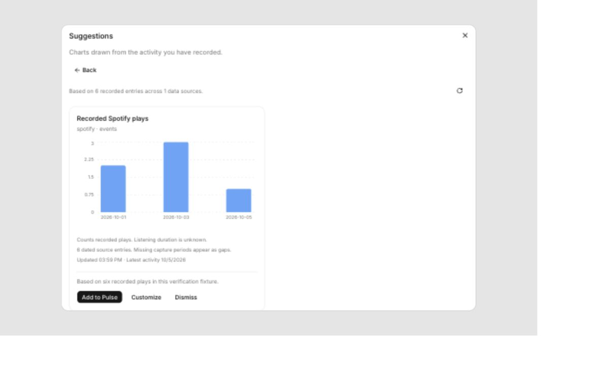

# Pulse discovery implementation and verification

Implemented locally on 6 October 2026. This is not pushed, deployed or verified against Rahul's live account. Existing unrelated Share to Action work remains in the workspace.

## User flow

An empty canvas contains only an accessible plus button. Plus offers Create manually or Suggestions. Suggestions can be added directly, customized with a real preview, or dismissed. Manual creation chooses a supported measurement and shows a preview before saving. Existing boards remain accessible.

Core profiles the user's permitted completed spans, active schemas and consented connections. Unschematized imports are included. Planned expenses, duplicates and revoked connections are excluded. Recipes produce supported measurements; Gemini can rank additional candidates using bounded summaries of up to 40 measurements. Raw records are not sent to that prompt and content telemetry is disabled. Malformed, unsupported or unavailable model candidates are discarded; deterministic recipes remain available.

Each candidate is calculated before display. Spotify play counts work without duration fields; full track durations are explicitly estimates. YouTube playlist additions are separate from watched videos. PlayStation lifetime totals and observed increases are separate; neither is assigned to fabricated daily sessions. Active subscriptions with explicit intervals produce projected monthly cost. Currency groups remain separate. Explicit intervals split at local timezone boundaries; calendar time is labelled scheduled and does not establish attendance. Missing capture periods remain null gaps.

## Chart execution and database cost

Saved version-2 definitions specify an approved measurement, timezone, period and grouping. Core validates the definition and compiles fixed parameterized SQL; the model cannot execute SQL. One aggregate statement handles up to 12 charts per page. Time series return at most 366 points, categorical charts at most 20 values. Aggregate concurrency is two per service and requests time out after five seconds.

Revision keys change with span edits/deletes, schema permissions and connection consent. Profiles and discovery expire after 15 minutes; results expire after 60 seconds. Cache entries are bounded by count and payload size. Database advisory locks coalesce aggregate requests across service instances, including overlapping forced refreshes. Discovery also takes a cross-instance lock. Saving is atomic and idempotent and rejects changes to the profiled revision.

A visible canvas has a 60-second fallback refresh plus debounced live-event updates; hidden canvases do not poll. Refresh retains loaded pages and removes duplicate chart IDs caused by page overlap.

Six-chart tests instrumented PostgreSQL `pg_stat_statements` in an isolated disposable PostgreSQL 17 database:

| Fixture spans | Cold calls | Cold duration | Cached calls/load | Cached p50 / p95 | Forced refresh calls / duration |
| --- | --- | --- | --- | --- | --- |
| 1,000 | 5 | 30.87 ms | 1 | 1.27 / 1.95 ms | 5 / 29.33 ms |
| 100,000 | 5 | 2,197.28 ms | 1 | 2.06 / 2.47 ms | 5 / 2,158.42 ms |

These are client database statements, not counts of internal statements in the cache function. Cold calls cover metadata, profiling, profile-cache persistence, the batched cached aggregate function and result-cache persistence. Warm calls fetch metadata and the cached results together. The cache function internally locks, checks, computes, prunes and persists. Discovery has additional lock and cache-write work and may make one model call. Benchmarks are local fixtures, not production latency estimates. Query-count tests must run without other tests against this database; a concurrent regression run contaminated one measurement and was rerun in isolation.

Cold calculations still scan relevant user rows. Repeated cold requests on large histories can be expensive even with few round trips. No daily rollup system is included. The bounded, cached implementation is the first practical slice; materialized daily aggregates should follow if real usage demonstrates persistent cold-load pressure.

## Verification

- Full nonignored Core suite: 25 passed; tests requiring dedicated integration databases remain ignored.
- Pulse suite: 18 correctness/regression tests plus the isolated six-chart performance test. Covers counts, estimates, timezone boundaries, undated records, currency separation, subscription status, gameplay aggregation, imports, connection identity, revocation, revisions, cached edits/deletes, save replay/conflict, stale candidates, concurrent refreshes and user deletion.
- Desktop production build passes; changed-file ESLint passes.
- Desktop tests: six passed with a temporary Node loader resolving existing Vite aliases/assets; three are Pulse settings/request-generation/page-overlap tests. Plain Node cannot resolve the pre-existing external-URL test's Vite aliases.
- Browser fixture inspected at narrow and desktop widths: empty/plus choices, manual preview/save, suggestions/customize/save, dismissal, no-suggestion state and retry/error state. The fixture imports the actual Pulse components and uses explicitly synthetic data.
- Native Vox account, live provider data, production migrations and live Gemini discovery were not verified. Migrations were applied only to the disposable local database.

## Review fixes and implementation choices

An independent read-only review identified six issues, each addressed: inactive subscription filtering, gameplay aggregation by platform, cross-instance calculation coalescing, old sources occupying all candidate slots, visible fallback/pagination preservation, and connected/imported source identity. Calculation regressions first reproduced the bugs and then passed after correction.

The implementation uses one batched aggregate rather than four separate groups, yielding five cold round trips overall. Modules are consolidated into measurement, execution, service and repository files rather than duplicating layers from the plan. Existing legacy rendering remains intact; a new card renders version-2 results. There is no connector-ingestion change, deployment, push or rollup infrastructure in this slice.

## Visual fixture evidence

This screenshot shows synthetic Spotify entries, not personal account data.

Additional proposed experiments were not performed: fake-clock TTL expiration, live model failure injection, heterogeneous-chart large-data benchmarks, scanned-row and pool-wait profiling, and complete native keyboard/legacy-board walkthroughs. Cache/revocation and representative real PostgreSQL calculations have the evidence listed above.
