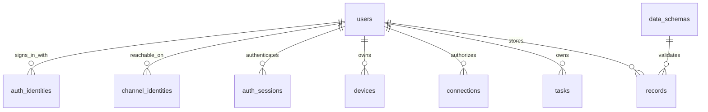

# Vox Core Database Simplification Plan

> **For agentic workers:** Use `superpowers:executing-plans`. This is a proposed target model and migration plan, not executable production SQL or authorization to delete data.

**Goal:** Replace overlapping platform/execution concepts with a comprehensible consumer Vox schema while preserving authorization, durable jobs, and safe external actions.

**Architecture:** One PostgreSQL database, typed relational columns for identity/ownership/workflow state, JSONB for flexible user records and bounded metadata. One canonical `users.id`; login identities and channel identities each refer to it. SQL tables are defined by developers; agents define validated JSON schemas stored as data.

**Tech stack:** Existing PostgreSQL/SQLx, optional pgvector for measured search needs, Redis for rebuildable caches and short-lived presence. No MongoDB migration is proposed.

**Spec:** User-supplied 54 application-table catalog plus `_sqlx_migrations`, inspected migrations, and [Core reorganization plan](2026-09-22-core-reorganization.md).

## Decisions and scope

- User confirmed one consumer Vox product with direct sign-in. Retire third-party host organizations/embedding after compatibility callers and ownership mappings migrate.
- Keep users independent of Google. Login methods and delivery channels are different associations; both point to the user, not to each other.
- Confirmed target: **21 application tables**, excluding voiceprints, spending_policies, operational_quotas, quota_reservations, status_events, connection_grants, service_credentials, auth_challenges, and service_nonces. Service credentials live in Google Secret Manager; temporary verification/replay state lives outside SQL. Optional webhook delivery is excluded from this release. SQLx/auth-provider metadata is outside the count.
- These counts describe a target, not a promised physical production reduction. Compatibility and migration mapping tables temporarily increase the count.
- Do not move everything into one giant user JSON document. Tasks, approval consumption, attempts, leases, and connection permissions need atomic updates and independently bounded histories.
- Preserve existing migrations while old releases use them. The historical create-only/zero-business-row/no-backup reset preference is separate from this design; it is not evidence that a reset happened or blanket authorization to execute a new one.

## Why PostgreSQL rather than MongoDB

Vox's difficult writes are relational: approve one proposal, consume its authorization once, start an execution, record an attempt, and append an audit entry together. PostgreSQL already fits the stack and also supports indexed JSONB for flexible documents. [PostgreSQL JSON types](https://www.postgresql.org/docs/16/datatype-json.html)

MongoDB supports multi-document transactions, so it is technically viable. It would still require careful boundaries, indexing, and migration work; its documentation explicitly notes the higher cost of distributed transactions relative to single-document writes. It does not remove Vox's identity and execution relationships. [MongoDB transactions](https://www.mongodb.com/docs/manual/core/transactions/)

Use MongoDB only if a demonstrated document-oriented workload warrants a separate storage choice. Dynamic user fields alone are not that evidence. Keep large raw audio/media in object storage, not JSONB; store references and retention metadata in records/events where necessary.

## The identity model



Example: a user has `users.id = U1`, a Google subject in auth_identities pointing to U1, and separately verified phone and WhatsApp rows pointing to U1. Removing Google access does not orphan channels or records. An unknown caller can have a provisional user with no Google identity, but that principal has restricted privileges until possession/account linking is established. Caller ID or a recognized voice is not by itself a login credential for purchases or private data.

Use Google `(issuer, sub)` as the provider identity; email is mutable profile data. Validate the ID token and intended audience before resolving the row. Google recommends `sub` as the stable account identifier. [Google OpenID Connect](https://developers.google.com/identity/openid-connect/openid-connect)

Channel linking requires both an authenticated user session and a scoped possession challenge. Never merge accounts simply because phone/email strings match. If a channel is already linked elsewhere, require proof for both accounts and an explicit merge flow; otherwise reject without disclosing the other owner. Service/Bridge trust proves who submitted a channel event, not that every caller is authorized for every action.

## Confirmed removals and replacements

- Remove spending_policies, operational_quotas, and quota_reservations from the target. Purchases require approval of exact details/amount/currency; configured rate limits and retry caps remain, without claiming durable financial budget enforcement.
- Remove status_events. Apps poll current tasks/jobs/executions. No durable status cursor or SSE replay contract in this release.
- Remove connection_grants. Connections carry explicit allowed_capabilities enforced by application services; local executors run scoped inference jobs and receive no connector credentials or arbitrary connector-tool access.
- Remove service_credentials. Google Secret Manager holds service secrets and credential versions; fixed trusted service identities/audiences remain configured in Core. Keep service authentication and coordinated rotation while retiring SQL registry dependencies. Secret storage does not itself authenticate incoming HTTP requests.
- Remove auth_challenges. Use a verification provider for phone/WhatsApp possession, with short-lived linking/OAuth flow state bound to the user/session in Redis if needed. Google sign-in authenticates the Google account, not an arbitrary number typed into the app. An added number stays unverified until proof succeeds; it cannot be used to resolve incoming calls/messages to private user data beforehand.
- No service_nonces SQL table. A nonce is a random identifier attached to a signed service request so the receiver can reject a second use. Keep a shared atomic TTL replay cache in Redis for the existing signed-assertion protocol, keyed by credential version and nonce. Validate timestamp/audience/signature first; a legitimate retry is signed with a fresh nonce but retains its business idempotency key.
- Replay-cache failure is fail-closed for protected service requests. Cache eviction/reset cannot silently reopen the accepted window: use a dedicated non-evicting store and invalidate the old credential epoch or wait out the timestamp window before resuming after state loss. Generic greeting-cache fallback is separate from this authentication decision.

Removing these tables is a target-schema decision. Retire their callers and migrate the replacement behavior before dropping legacy structures. Existing source API inventory remains historical until the implementation retires endpoints.

### What inbound_events stores

Each row is an incoming observation with a shared envelope and a type-specific JSONB payload. It is a durable ingestion receipt, not the final universal store for all user information.

```text
id, user_id, source_kind, source_id, external_event_id,
event_type, payload_version, occurred_at, received_at,
payload JSONB, payload_hash, processed_at, processing_error
```

Core derives user_id and source_id from authenticated device/connector context. The client cannot select another owner. For example:

| event_type | payload_version | Example payload |
| --- | --- | --- |
| sms.received | 1 | {"sender":"BANK","body":"Card purchase INR 450 at Cafe"} |
| location.observed | 1 | {"latitude":12.97,"longitude":77.59,"accuracy_m":20} |
| finance.transaction.imported | 1 | {"provider_transaction_id":"tx-123","amount_minor":45000,"currency":"INR","direction":"debit","merchant":"Cafe"} |

The table above is illustrative JSON, not actual private data. event_type selects an input schema; payload_version pins its version. Validate each producer payload, maximum size/depth, timestamps, and source permissions before durable acceptance. The ingestion schemas describe transport inputs; data_schemas describes user records and can evolve independently.

Flow: authenticated event -> atomic event/job insertion -> Worker normalization/extraction -> schema-validated records -> task planning or statistics as needed. Raw bank SMS may produce a finance.expense record with source_event_id provenance. A bank connector transaction can produce the same normalized record type directly. Financial observations are not payment authorization or an accounting ledger.

Deduplicate transport retries by (user/source scope, external_event_id); reject the same key with a different payload hash. Commit derived records and processed state atomically. One event can yield several records: use a stable extraction output key plus source event ID to prevent duplicate outputs. SMS and bank imports describing the same payment need a separate domain deduplication/reconciliation rule; transport dedupe alone cannot identify them.

Keep frequently filtered fields in columns; JSONB holds variable data. Do not add one nullable SQL column per event type. Apply per-type retention and user deletion policies; event receipt is not permission for indefinite raw SMS/location retention. Partition/high-volume storage is a measured later decision.

### Generalize projects into collections

Use one `collections` table with `id,user_id,name,kind,description,status,metadata,version,created_at,updated_at`. Examples: kind=project (Launch Vox), trip (Goa), course (Rust), area (Health). Keep task status/due date and record schema/data on their own tables.

Start with one optional primary `collection_id` on tasks and records, constrained to the same user. No hierarchy, membership/roles, universal entity table, or arbitrary polymorphic foreign keys. If multi-collection membership becomes necessary, add typed task_collections/record_collections join tables then. Custom grouping fields may use bounded metadata; they do not replace task/record validation.

Rename target project APIs to `/v1/collections`; legacy project tools/routes select kind=project. Collection deletion archives by default; explicit removal either detaches children transactionally or is rejected until detached. It must not cascade-delete tasks or records. Test cross-user attachment, rename, archive, and migration of old project IDs.

## Target table catalog and keys

All mutable user resources use `user_id`, `created_at`, `updated_at`, and optimistic `version` where clients edit them. Below are important fields, not final executable DDL. Every FK, check, delete policy, and index must appear in the implemented baseline/migrations.

| # | Table | Purpose and essential fields/constraints |
| --- | --- | --- |
| 1 | `users` | UUID PK; status `provisional/active/disabled`; display_name; bounded `preferences`, `profile_facts`, `persona` JSONB; profile_version |
| 2 | `auth_identities` | id, user_id FK, issuer, subject, profile metadata, verified_at; UNIQUE(issuer,subject); no passwords/provider tokens in profile |
| 3 | `channel_identities` | id, user_id FK, channel, provider_scope, normalized_external_id, verified_at, revoked_at; unique active `(channel,provider_scope,normalized_external_id)`; scope separates provider accounts where required |
| 4 | `auth_sessions` | user_id, auth_identity_id, device_id nullable, token_hash UNIQUE, family_id, expires_at, revoked_at; rotating refresh token reuse detection; store hashes only |
| 5 | `conversations` | user_id, channel_identity_id nullable, external_conversation_id, channel, state, latest summary JSONB plus summary_version/summary_through_sequence; unique channel-scoped external conversation |
| 6 | `messages` | conversation_id, sequence_number, role, text, created_at; UNIQUE(conversation_id,sequence_number); sequence allocation serialized per conversation |
| 7 | `collections` | user_id, name, description, kind, status, metadata JSONB, version; reusable grouping for projects, trips, courses, and areas; not an authorization workspace |
| 8 | `tasks` | user_id, collection_id nullable, title, instruction, status, priority, due_at, version, cancellation_requested_at; user intent separate from attempts |
| 9 | `schedules` | user_id, task_id nullable, instruction/job specification, kind, recurrence, timezone, next_run_at, state; recurring intent distinct from each job occurrence |
| 10 | `jobs` | user_id nullable for system jobs, kind, task_id/schedule_id/source_event_id nullable, dedupe_key, input_reference/snapshot version, checkpoint, state, wait_reason, available_at, deadline_at, max_attempts, attempt_count, lease_generation, lease_owner, lease_expires_at, execution_policy, assigned_device_id; one scheduler |
| 11 | `job_attempts` | job_id, attempt_number, lease_generation, executor_kind/device_id, started_at, heartbeat_at, finished_at, outcome/error, result_reference; UNIQUE(job_id,attempt_number); terminal results fenced against jobs generation |
| 12 | `data_schemas` | id identifies immutable version; user_id nullable for global, namespace, name, version, json_schema, state, created_at; separate unique indexes for global and per-user name/version |
| 13 | `records` | user_id, schema_id FK, kind `fact/goal/insight`, title, data JSONB, occurred_at, source_event_id nullable, source metadata, collection_id nullable, source_record_ids for bounded lineage, valid_until, version; do not represent task/execution state as generic records |
| 14 | `devices` | user_id, stable enrollment identifier, platform, label, public key/credential reference, capabilities JSONB, execution consent, last_seen_at, revoked_at; UNIQUE(user_id,device_identifier) |
| 15 | `connections` | user_id, provider_key/catalog_version, external_account_hash, secret_reference, scopes, allowed_capabilities, authorization_state, expires_at, revoked_at, sync_cursor; credentials remain in secret store |
| 16 | `action_proposals` | user_id, task_id/job_id nullable, actor_key, connection_id, capability, immutable details/details_hash, state, expires_at; changing content creates a new proposal |
| 17 | `action_approvals` | proposal_id UNIQUE, user_id, approved_details_hash, session/actor evidence, approved_at, consumed_execution_id nullable UNIQUE; consumption and execution creation atomic |
| 18 | `executions` | user_id, proposal_id UNIQUE, approval_id UNIQUE, connection_id, idempotency_key, provider/capability/version snapshot, state, provider_reference, confirmation_evidence, policy_snapshot; UNIQUE(user_id,idempotency_key) |
| 19 | `execution_attempts` | execution_id, attempt_number, immutable request identity/hash, state, provider_reference, evidence/error, policy decision snapshot; UNIQUE(execution_id,attempt_number); provider retry safety remains explicit |
| 20 | `inbound_events` | user_id nullable until provider-event resolution, source_kind, source_id, external_event_id, payload_hash, event_type, payload_version, occurred_at, received_at, payload/reference, execution_id nullable, processed_at; unique source-scoped dedupe identity including provider account/tenant |
| 21 | `audit_events` | cursor PK, user_id nullable, actor, event_type, affected IDs, occurred_at, immutable details, schema_version; append-only application role |

Voiceprints are excluded: the user states VAD and speaker verification have been removed for now. The earlier source inspection is historical and does not override that scope. External webhook subscription/export tables are also excluded from this release; existing consumers must migrate before their legacy storage is retired.

The auth tables above assume Core owns consumer session issuance after provider authentication. If a managed auth system becomes authoritative, use its verified subject/session model rather than duplicating local auth_sessions; adjust counts and migration scope explicitly. Existing admin NextAuth is not automatically that consumer authority.

## Current table disposition: every table accounted for

| Current table | Target/disposition |
| --- | --- |
| `_sqlx_migrations` | Keep tool-managed bookkeeping; never manually delete it to force reapplication against existing objects |
| `users` | Keep canonical ID; merge bounded profile fields |
| `user_identities` | Rename/migrate to channel_identities with verification/revocation metadata |
| `conversations` | Keep; merge latest summary; retire biometric active_user_id/verification_state after dependent code is removed |
| `messages` | Keep |
| `user_profiles` | Merge into users; split again only if size/contention warrants |
| `conversation_summaries` | Merge latest into conversations; retain historical summary evidence in audit/archival records if consumers require it |
| `events` | inbound_events |
| `scheduled_tasks` | schedules |
| `jobs` | jobs; consolidate run/checkpoint ownership |
| `projects` | collections(kind=project); preserve IDs where possible; compatibility project routes/tools map to kind=project |
| `tasks` | Keep business task state; attempt/checkpoint history goes to jobs |
| `user_goals` | records(kind=goal) with versioned system schema and typed adapter APIs where needed |
| `user_records` | records(kind=fact) |
| `user_insights` | records(kind=insight), preserve provenance/expiry/outcome semantics |
| `client_devices` | devices |
| `data_schemas` | Keep; immutable versions and ownership validation |
| `user_voiceprints` | Retire; no voiceprint table in this release. Remove dependent reads/writes before schema retirement |
| `platform_deployments` | Retire in consumer mode; deployment identifier becomes operational config |
| `host_apps` | Retire registry; fixed service identities in configuration, secrets in Google Secret Manager |
| `host_organizations` | Retire only after external-organization product dependency is removed |
| `user_contexts` | Retire through explicit old-context-to-user mapping; do not silently collapse unrelated scopes |
| `host_app_credentials` | Retire SQL registry after migrating Bridge credentials/versions to Google Secret Manager and compatible Core validation |
| `host_app_assertion_nonces` | Retire SQL nonce table after shared Redis replay protection is verified |
| `identity_adapters` | Versioned trusted-provider configuration; no arbitrary user-configured identity verifier |
| `login_identities` | auth_identities; hashed legacy subjects may require reauthentication, not fabricated Google IDs |
| `federated_identity_nonces` | Retire legacy federated flow; retained signed service assertions use Redis replay protection |
| `passwordless_recovery_challenges` | Retire SQL challenge table; provider-managed verification and temporary user-bound flow state |
| `identity_authentication_sessions` | auth_sessions or force reauthentication during incompatible cutover |
| `identity_links` | Verified account-link operation updates identity ownership atomically; historical facts become audit events |
| `identity_link_events` | audit_events |
| `agent_definitions` | Versioned code/config catalog; executions record actor/model version |
| `agent_model_configurations` | Versioned configuration; immutable historical snapshots retained |
| `deployment_agent_selections` | Deployment config |
| `integration_definitions` | Versioned connector catalog in code/config |
| `integration_capability_declarations` | Connector capability manifest; retain effect/recipient/region/failure declarations |
| `external_connections` | connections |
| `agent_capability_grants` | Retire; allowed_capabilities on connections and scoped inference-only device jobs |
| `task_runs` | jobs + job_attempts; preserve wait/checkpoint/cancellation semantics |
| `action_proposals` | Keep immutable intent |
| `action_approvals` | Keep separate consent/consumption lifecycle |
| `spending_policies` | Remove; exact-purchase approval replaces standing spending permission |
| `operational_quotas` | Remove; configured rate/concurrency limits, no durable quota accounting |
| `operational_quota_reservations` | Remove with operational quotas |
| `execution_policy_decisions` | Snapshot on execution_attempts for started work; denied decisions preserved in append-only audit events |
| `executions` | Keep |
| `execution_attempts` | Keep |
| `outbound_calls` | Bridge-call execution details/provider reference on executions plus task/schedule context; migrate only after Bridge callback compatibility is implemented |
| `status_events` | Remove; poll current task/job/execution state |
| `status_webhook_subscriptions` | Retire for this release; no external status subscriptions |
| `status_webhook_deliveries` | Retire after pending delivery lifecycle is explicitly closed; no replacement table |
| `integration_external_events` | inbound_events(source_kind=connector); preserve durable callback dedupe |
| `audit_events` | Keep append-only sensitive-action history; no status feed dependency |
| `audit_sink_definitions` | Retire external export feature for this release; keep internal audit history |
| `audit_sink_deliveries` | Retire after pending export lifecycle is explicitly closed; no replacement table |

Do not delete functionality solely to meet the count. If historical summaries need independent querying, keep their table. If connector catalogs must be edited dynamically by external tenants, retain their tables and ownership model. These are explicit alternatives, not reasons to hide metadata in unconstrained JSON.

## Integrity rules and useful indexes

- Every user-owned query is scoped by Actor.user_id. Enforce same-owner references with composite `(user_id,id)` keys/FKs for task/collection, task/job, proposal/approval/execution relationships where applicable. Do not trust a UUID alone.
- Schema ownership is `global OR owned by record user`; enforce in the application and with a composite schema-scope FK. Store generated `data_schemas.owner_scope = COALESCE(user_id::text, 'global')`, add UNIQUE(id,owner_scope), and require non-null `records.schema_scope` with CHECK(schema_scope = 'global' OR schema_scope = user_id::text) plus FOREIGN KEY(schema_id,schema_scope) REFERENCES data_schemas(id,owner_scope). Records.user_id and schema_id are non-null. This expresses the rule using inline constraints without a trigger; test the generated expression against the deployed PostgreSQL version before adoption.
- Use explicit CHECK constraints for state, nonnegative limits, paired lease fields, expiry ordering, and JSON object shape. A state CHECK is not a transition guard; transitions use conditional UPDATE and affected-row checks.
- Build task indexes `(user_id,status,due_at,id)`, record indexes `(user_id,schema_id,occurred_at,id)`, messages `(conversation_id,sequence_number)`, ready jobs `(available_at,id) WHERE state='queued'`, and lease recovery `(lease_expires_at) WHERE state='running'`.
- Add JSONB indexes for observed filters, not every dynamic field. Cross-user index scans do not replace row authorization. Add vector indexes only after query plans/volumes justify them.
- Preserve stable snapshots of approved payloads, connection identity, capability versions and policy versions across catalog changes.
- One transaction consumes approval and creates execution/attempt and audit as appropriate. Provider requests run after commit; commit intent before external effects, and reconcile unknown outcomes after crashes.
- Jobs are at-least-once computation. A single fenced acceptance and idempotent business operation prevents duplicate accepted effects; no claim of universal exactly-once provider execution.
- Keep inbound ingestion data and security audit separately retained; user-visible status is read from current resource rows. They have different payloads, access policies, and deletion requirements despite similar timestamps.
- Raw SMS/location events have an explicit retention policy; derived records retain provenance and deletion lineage. Account deletion revokes sessions/devices/connections, cancels jobs, deletes appropriate user data and vectors/cache entries, and preserves only explicitly required audit evidence with a documented policy.

## Implementation and migration sequence

### DB1: Inventory and freeze the migration contract

**Files:** `migrations/*`, `schema/*`, `supabase_schema.sql`, `tests/migration_contract.rs`, `tests/migration_checksums.rs`, checksum fixture.

- [ ] Capture actual schema, constraints, indexes, extension versions, table counts and row counts from the intended environment using read-only inspection. The pasted columns omit many FK/check/index details; never infer that these constraints are absent.
- [ ] Trace every table's code and external consumer. Check platform-scope and audit/subscription use before retiring their features.
- [ ] Record legacy `user_contexts -> users` mappings and duplicate channel/login subjects. Freeze immutable migration bytes and document the existing checksum-fixture edit rather than overwriting it.
- [ ] Make migrations authoritative; generate schema/reference docs and retire stale manual `schema/17_actions.sql` and `18_action_attempts.sql` only after checking consumers.

**Acceptance:** each of the 54 tables has a verified disposition and live constraints/row counts are separately recorded when access is available.

### DB2: Specify identity, schema, and execution constraints in isolated tests

**Files:** create `tests/consumer_identity.rs`, `tests/schema_versions.rs`, `tests/job_fencing.rs`, `tests/database_target.rs` and target schema documentation.

- [ ] Write tests for multiple Google identities linked explicitly to one user, same email/different subject remaining distinct, duplicate active channel collision, revoked channel reassignment, expired/reused challenge, service nonce replay, and unverified caller denied sensitive data.
- [ ] Write tests for global/user schema lookup, immutable versions, cross-user record schema rejection, valid nested JSON, unknown explicit schema failure, record update version conflict.
- [ ] Write concurrent transaction tests for initial features: approval cannot be consumed twice; stale job generation cannot commit; duplicate event creates one logical effect.
- [ ] For any shared-key merge, prove row-level ownership preservation with two users and same-looking external IDs. Test both request-layer and repository access.

**Acceptance:** target behavior is specified before migrations or application adapters change.

### DB3: Produce the new baseline as an offline artifact

**Files to create during implementation:** `schema/target_core.sql` and catalog-generated ER/table docs; selected immutable migration version only when the rollout mode is chosen.

- [ ] Implement the confirmed 21-table target with inline FKs/checks and indexes, in dependency order. Resolve circular approval/execution links by choosing one directional FK plus unique reference enforced in the same transaction, rather than inventing an invalid create order.
- [ ] Use CREATE-only statements for the empty baseline, with extensions/tables/indexes and final constraints inline. No ALTER/DROP/INSERT/UPDATE/DELETE in this baseline. Implement the composite schema-scope FK above and verify global, same-user, and foreign-user cases; no schema-owner trigger is needed.
- [ ] Zero business rows after baseline. Global/system schemas and service credentials are provisioned through explicit post-deploy application/admin flows, not seed DML hidden in the baseline. SQLx's migration bookkeeping row is expected.
- [ ] Provision a disposable PostgreSQL database with required extensions; apply baseline, run catalog assertions, verify zero business rows, run constraints and concurrent tests, then destroy only that disposable database.
- [ ] Do not place the new baseline beside the old create-table history in the active migration directory; replaying both against one database is invalid.

**Acceptance:** clean install is deterministic and all enabled features have their target tables/contracts.

### DB4: Choose and execute one cutover mode as a separate operation

**Mode A — fresh, zero-row replacement:** matches the previously recorded create-only preference if reaffirmed for this target. No implicit backup or seed is added. Before execution, bind the exact target environment and Vox-owned allowlist, stop API/Worker/Bridge ingress as needed, disable old schedulers, choose the new compatible application artifact and migration history, and review the destructive statement set separately. Preserve Supabase Auth/Storage, extensions, roles, grants and unrelated schemas. Do not treat this document as an executed reset.

Recreate only the agreed Vox scope, apply the new baseline once, provision required credentials/system schemas explicitly, start compatible services, and verify auth/ingestion/jobs. Flush only the explicitly selected Vox cache namespace/DB. With a no-backup destructive cutover, the old data cannot be restored; reverting an application binary does not restore it.

**Mode B — data-preserving migration:** alternative if existing data must survive. Retain old migrations; add expand/backfill/validate/switch/contract migrations. Do not mix this mode's DML with the CREATE-only baseline or claim both are one script.

- [ ] Add new structures and nullable transitional references; retain old tables while old clients work.
- [ ] Backfill with recorded ID maps in resumable bounded batches. Keep user IDs where safe; preserve separate scopes until identity proof allows linking. Hashed login subjects require reauthentication if the original issuer/subject cannot be recovered.
- [ ] Translate goals/insights with explicit system schema versions; preserve outcome/expiry/provenance. Move summary version boundaries; migrate run checkpoints with pinned payload versions. Map outbound call IDs to execution IDs for old callbacks.
- [ ] Handle writes during backfill using transactional dual writes/change capture or a deliberate maintenance window. Perform reconciliation before read switch; uncontrolled parallel writes are not acceptable.
- [ ] Compare counts, owner maps, unique keys, representative payload hashes and orphan queries; validate new constraints.
- [ ] Switch reads/writes and credentials under a controlled release; drain leases and callbacks. Keep mapping/compatibility until callback and client retention windows expire.
- [ ] Drop retired tables only after no writers/readers remain. Rollback after new-only writes requires reverse mapping or reconciliation, not simply switching old code back on.

**Acceptance:** one rollout mode is explicit, source/migration versions match, and ownership/effects survive the selected transition semantics.

### DB5: Verification and operational handoff

- [ ] Run the full isolated PostgreSQL integration suites serially or give each suite its own database; current tests use TRUNCATE and are unsafe against shared/production DBs.
- [ ] Verify auth exchange/provider-verified channel link, Secret Manager-backed service authentication, Redis replay rejection, task CRUD without LLM, record schema validation, typed event payloads and dedupe, schedule occurrence uniqueness, competing workers, desktop timeout, and purchase/call reconciliation.
- [ ] Verify Core/Bridge callback and greeting contracts across the identity migration. Cache reconstruction must not block generic greetings.
- [ ] Generate catalog documentation from the active baseline/migrations; export endpoint specs from the matching application release.
- [ ] Record local validation, migration execution, service deployment and live workflow verification separately. A successful SQL parse or fewer tables does not prove migration correctness.

## Deferred decisions with safe defaults

- VAD and speaker verification are out of scope per user direction. Do not restore biometric enrollment, matching, active-speaker switching, model downloads, or a voiceprint table. Preserve provider webhook verification, sign-in authentication, and channel-possession checks.
- Retire external audit/status subscriptions explicitly and migrate any existing consumers before cutover; no webhook subscription/delivery tables in this target.
- Use code/config agent and connector catalogs for the consumer product. If runtime third-party registrations remain a product requirement, retain relational catalogs and revise the target count.
- Managed auth is optional; initial plan uses standard verified Google identity plus Vox sessions. Do not build a custom password cryptography system.
- No table-per-user or table-per-generated-schema. New data types are schema rows; new records are JSONB rows. Promote a field/entity to typed columns only when query volume or invariants justify it.
